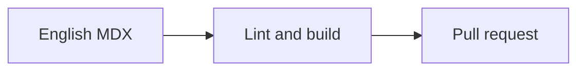

{/* @format */}

import useBaseUrl from "@docusaurus/useBaseUrl";

<div style={{float: "right", marginLeft: "1.5rem", marginBottom: "1rem"}}>
  
</div>

The wiki is a [Docusaurus 3](https://docusaurus.io/) site. All source files are
in the [`z-shell/wiki`](https://github.com/z-shell/wiki) repository. English is
the source language; translations are managed via [Crowdin](https://translate.zshell.dev).

## Prerequisites

- [Node.js](https://nodejs.org/) 24 LTS
- [pnpm](https://pnpm.io/) 11

## Local Development

```sh
git clone https://github.com/<your-username>/wiki.git
cd wiki
pnpm install          # install dependencies
pnpm start            # dev server at http://localhost:3000
```

Other useful commands:

| Command                  | Purpose                                                  |
| ------------------------ | -------------------------------------------------------- |
| `pnpm build`             | Full production build                                    |
| `pnpm build:en`          | English-only build (faster for docs-only checks)         |
| `pnpm serve`             | Serve the production build locally                       |
| `pnpm clear`             | Clear Docusaurus cache (use when the site behaves oddly) |
| `pnpm lint`              | Run Trunk linters and formatting checks                  |
| `pnpm lint:fix`          | Auto-fix linting issues                                  |
| `pnpm write-heading-ids` | Regenerate heading IDs across all docs                   |

## Content Roots

The wiki has three independent docs roots:

| Directory    | URL Prefix   | Purpose                                      |
| ------------ | ------------ | -------------------------------------------- |
| `docs/`      | `/docs`      | Core documentation, getting started, guides  |
| `community/` | `/community` | Community guides, Zsh plugin standard, tools |
| `ecosystem/` | `/ecosystem` | Annexes, packages, plugins                   |

## File Naming Conventions

- **Numeric prefixes** control sidebar order: `01_first.mdx`, `02_second.mdx`
- **Directories** need a `_category_.json` file (see below)
- **All English source files only** — never edit files under `i18n/`

### Frontmatter

Every `.mdx` file requires these fields:

```mdx
---
id: unique_page_id
title: "Page Title"
sidebar_position: 1
image: /img/png/theme/z/320x320.png
description: One-sentence description for SEO.
keywords:
  - relevant
  - keywords
---
```

### `_category_.json`

Required for every new directory:

```json
{
  "label": "📁 Section Name",
  "position": 1,
  "link": {
    "type": "generated-index"
  }
}
```

## MDX Authoring Patterns

### Choose the simplest useful presentation

Start with ordinary Markdown and add a richer element only when it improves
comprehension or scanning.

| Need                                             | Use                                     |
| ------------------------------------------------ | --------------------------------------- |
| Short comparison or reference matrix             | GFM table with compact cells            |
| Steps that must happen in order                  | Numbered list                           |
| Work readers can complete                        | GFM task list (`- [ ]`)                 |
| Advice, context, risk, or danger                 | Docusaurus admonition                   |
| Optional or advanced explanation                 | `<details>` with a one-line `<summary>` |
| Equivalent operating-system or tool instructions | `<Tabs>` and `<TabItem>`                |
| Process or relationship that is clearer visually | Mermaid diagram plus a prose summary    |
| Landing-page navigation                          | `<CardGrid>` and `<Card>`               |

Do not use tables for long prose or sequential procedures, tabs for sequential
steps, task boxes as decorative bullets, or raw HTML for layout. Blockquotes are
for attributed quotations; use admonitions for callouts.

### Admonitions

Use Docusaurus admonitions for callouts instead of blockquotes:

```mdx
:::tip
Helpful hint.
:::

:::info
Neutral information.
:::

:::warning
Something to be cautious about.
:::

:::danger
Critical warning.
:::
```

### Global MDX Components

These components are available in every `.mdx` file without importing:

| Component                                 | Usage                  |
| ----------------------------------------- | ---------------------- |
| `<Highlight color="...">text</Highlight>` | Colored text spans     |
| `<Emoji symbol="🎉" label="party"/>`      | Accessible emoji       |
| `<GhRepoBadge repo="z-shell/zi"/>`        | GitHub repo badge      |
| `<ShellCodeCopy>command</ShellCodeCopy>`  | Copyable shell command |

### Code Blocks

Use language identifiers and `showLineNumbers` when helpful:

````mdx
```zsh showLineNumbers
zi light z-shell/F-Sy-H
```
````

Add `title="path/to/file"` when a filename matters. Highlight only the lines
being discussed, and reserve `showLineNumbers` for longer examples referenced by
line number.

### Mermaid diagrams

Mermaid is available for flows and relationships that are harder to understand
as prose. The following diagram shows that English MDX must pass local checks
before it reaches pull-request review:



Keep diagrams small, label nodes in plain language, explain their conclusion in
text, and never rely on color alone to communicate meaning.

### Links

Prefer relative links between pages:

```mdx
See [Getting Started](../getting_started) for more details.
```

Use absolute URLs only for external resources.

## Branch and PR Workflow

1. Branch from `main`: `git checkout -b feature-123 main`
2. Make changes to English source files only
3. Run `pnpm build:en` to catch broken links and MDX errors
4. Open a PR targeting `main`

:::warning[Never edit `i18n/` files directly]
Translation files under `i18n/` are managed exclusively through [Crowdin](https://translate.zshell.dev). Manual edits will be overwritten on the next sync.
:::

## Localization

The wiki supports multiple languages via Crowdin. To contribute a translation:

1. Join the project at [translate.zshell.dev](https://translate.zshell.dev)
2. Translate strings in the Crowdin editor
3. Approved translations are synced back to the repo automatically

Do **not** fork the repo and edit `i18n/` files manually.

## Style Guidelines

- Use sentence case for headings (e.g., `## Code of conduct`, not `## Code Of Conduct`)
- Keep paragraphs short — aim for ≤ 5 sentences per paragraph
- Prefer tables for structured comparisons
- Use admonitions sparingly — only when the callout level genuinely matches the content
- Formatting is enforced by Prettier (120-char print width, double quotes, 2-space indent)

## See Also

- [Getting Started](getting_started) — org-wide branch and commit conventions
- [Project Management](project_management) — how work is tracked
